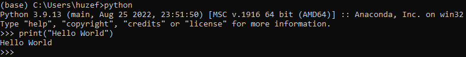
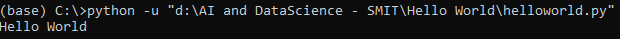
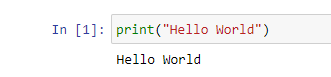

<h1>Hello World with Python</h1>
 
<h2>Step 1: Console<h2>
 
<ul>
<li>Search</li>
<li>anaconda prompt</li>
<li>anaconda cmd will open up</li>
<li>Write "python" there and press enter</li>
<li>Run code below in the terminal</li>
<li>print("Hello World")</li>
<li></li>
</ul>
 
<h2>Step 2: Create Physical File and run that in anaconda<h2>
 
<ul>
<li>Go to specific directory where you want to create a file and write code. there</li>
<li>That folder will open in vscode</li>
<li>Create a new file there called helloworld.py</li>
<li>Add code below in that file</li>
<li>print("Hello World")</li>
<li>Copy that file's path and run that in cmd</li>
<li></li>
</ul>
 
<h2>Step 3: Create Jupyter Notebook<h2>
 
<ul>
<li>Open Anaconda and open Jupyter Notebooks</li>
<li>Create a new file in Jupyter Notebooks</li>
<li>Create a new file there called jupyterhelloworld.py</li>
<li>Add code below in that file</li>
<li>print("Hello World")</li>
<li></li>
</ul>
